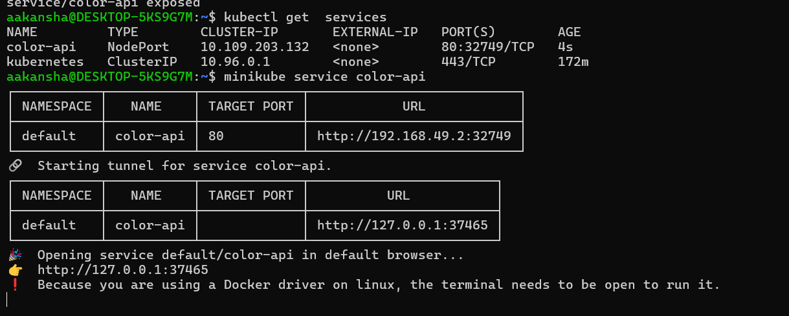
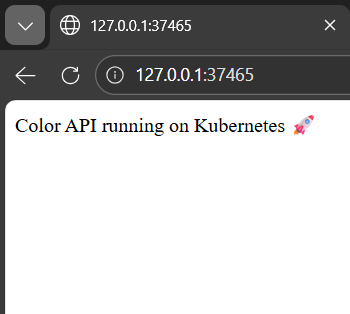

# Docker + Kubernetes Basic Project

This is a simple Node.js application deployed using Docker and Kubernetes (Minikube).

## Tech Used
- Node.js
- Docker
- Kubernetes
- Minikube
- WSL2

## Application
Simple API that returns a message.

## Steps

### 1. Create Node App
```
npm init -y
npm install express
```
2. Docker Build
docker build -t color-api:v1 .

3. Run Docker Container
docker run -d -p 3000:80 color-api:v1


Access:

http://localhost:3000

4. Push to Docker Hub
docker tag color-api:v1 aakansha113/color-api:v1.0
docker push aakansha113/color-api:v1.0

5. Run on Kubernetes
kubectl run color-api --image=aakansha113/color-api:v1.0 
kubectl expose pod color-api --type=NodePort --port=80

6. Test inside cluster
kubectl run -it alpine --image=alpine sh
apk add curl
curl http://color-api
OR 
curl http://<ip>

7. Acess on website :
minikube get services
minikube service color-api

## Kubernetes Output
 
<h3>minikube service color-api</h3>

<p align="center">
  
</p>

<h3>🚀 Color API running on Kubernetes</h3>

<p align="center">
  
</p>
